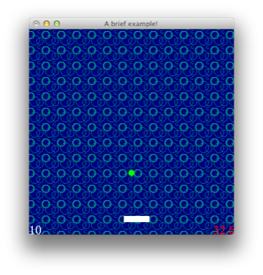
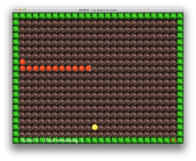

<style>
.a {
    font-weight:bold;
    color:red;
    font-size:200%;
}
.b {
    font-weight:normal;
    color:#bbb;
    font-size:smaller;
}
</style>

# <span class="a">Fun<span class="b">ctional</span> G<span class="b">ame</span> En<span class="b">gine</span></span>

FunGEn (Functional Game Engine) is a BSD-licensed, cross-platform,
OpenGL/GLUT-based, imperative game engine/framework written in
Haskell.  With very few dependencies and two example games, it's one
of the easiest ways to get started with game development in Haskell.



FunGEn, created by Andre Furtado, is intended to help game programmers
make games in a faster and more automated way. It supports:

* Initialization, updating, removing, rendering and grouping
  routines for game objects;
* Definition of a game background (or map), including texture-based
  maps and tile maps;
* Reading and intepretation of the player's keyboard and mouse input
* Collision detection;
* Time-based functions and pre-defined game actions;
* Loading and displaying of 24-bit bitmap files;
* Some debugging and game performance evaluation facilities;
* Sound support (maybe ? windows only)

**Home:**                  <http://joyful.com/fungen>
 \
**Hackage:**  <http://hackage.haskell.org/package/FunGEn>
 \
**Docs:**
 [0.4 API docs](http://hackage.haskell.org/packages/archive/FunGEn/0.4.1/doc/html/Graphics-UI-Fungen.html),
 [0.1 intro docs](old-site/index.html)
 <!-- Another version of the [pong tutorial](TUTORIAL.html), -->
 <!-- the [old site](http://www.cin.ufpe.br/~haskell/fungen), -->
 \
**Code:**           <http://hub.darcs.net/simon/fungen>
 \
**Discussion & help:**
 [#haskell-game](irc://irc.freenode.net/#haskell-game) IRC channel,
 [haskell-cafe](http://www.haskell.org/haskellwiki/Mailing_lists) mail list
 \


## Getting started



Install from hackage: 

```
$ cabal update
$ cabal install FunGEn
```

Install source and run the [examples](http://hub.darcs.net/simon/fungen/examples):

```
$ darcs get http://hub.darcs.net/simon/fungen
$ cd fungen
$ cabal install
$ (cd examples/pong; ghc pong; ./pong)
$ (cd examples/worms; ghc worms; ./worms)
```

Contribute patches:

```
- log in to hub.darcs.net and fork http://hub.darcs.net/simon/fungen
- push changes to your branch
- give me a "pull request" on #haskell-game
```

I ([Simon Michael](http://joyful.com)) maintain FunGEn
sporadically. If you'd like to take it and run with it, or
co-maintain, let's chat! I'm sm on the #haskell-game IRC channel.

---

## FAQ

**What is a game engine?**

A game engine can be considered as a library that provides game facilities
to a game programmer. When using a game engine, the programmer must
specify when the game events happen, rather than how they are
implemented. A same functionality may have its implementation varying from
platform to platform, in the case the engine is platform-independent. The
main advantage of a game engine is that it can be reused to the
development of many different kind of games, in an automated way, saving a
lot of programming time.

**Why Haskell?**

We believe that Haskell is a great language to develop games, because of
its high level of abstraction and the generation of a more concise,
elegant and shorter code. This is great for code maintenance and
understanding. Combining the power of Haskell with the facilities provided
by game engines seems a promising project. You can find more info on
Haskell in its official site.

**What is HOpenGL?**

HOpenGL stands for Haskell Open Graphics Library. Actually, it is a
binding to one of the most famous graphics libraries around the world
(OpenGL) and its auxiliary toolkit (GLUT). In other words, it makes
possible to call OpenGL/GLUT routines (which were written in the C
language) when programming in Haskell. You can find more info on HOpenGL
in my HOpenGL Tutorial site, or in its official site.

---

## Release notes

### 0.4.1 (2013/08/06)

* reorganised and exposed more haddocks

### 0.4 (2013/08/05)

* a new hakyll-based website, incorporating the old site
* tested with GHC 7.6
* input handlers now receive mouse position and modifier state
  (inspired by Pradeep Kumar).  See fungentest.hs for examples.
* more haddocks

### 0.3 (2011/02/13)
GHC 6.12-compatible 0.3 [released](http://thread.gmane.org/gmane.comp.lang.haskell.cafe/86330) on darcsden & hackage by Simon Michael:

- updated for GHC 6.12 & base 4
- module names simplified
- beginning of haddockification
- docs moved into repo
- published to darcsden, hackage, wiki, haskell-cafe, #haskell-game, reddit

### 0.1-hackage (2008/09/17)
GHC 6.10-compatible 0.1 released on hackage by Miloslav Raus:

- updated for GHC 6.10
- cabalised
- Tested under Win32 & Linux/Intel. Known glitches: Flickering under linux
  (at least on my shitty laptop). Weird pong paddle behavior under Win32.

### GHC 6.8 update (2008/02/26)
GHC 6.8-compatible update by Simon Michael:

- updated for GHC 6.8
- slight tweaks to examples
- public darcs repo

### 0.1 (2002)
First public release by Andre Furtado:

- FunGEn v1.0 can be downloaded here. (PLEASE NOTE: this is the very first
  version of FunGEn, and it was released just to get some feedback from
  game programmers. You are strongly invited to tell your game programming
  experiences with FunGEn, helping us to release a definitive, stable
  version). Ok, after this disclaimer, please fell yourself free to take a
  quick tour in the site; it contains a lot of useful information for
  those who are really interested in trying a new game programming
  experience. Nice coding...

- Current Status: Some feedback indicated that the first version of FunGEn
  was not as "functional" as it was desired: some game issues were still
  being dealt through an imperative fashion. This way, the authors of this
  project decided to change the game engine philosophy: programmers should
  describe a game as a set of "specifications" rather than defining its
  behavior imperatively. One plausible alternative for accomplishing this
  task is porting the Clean Game Library (CGL) to Haskell, adding some
  FunGEn specific features. Hence, this is the actual status of the FunGEn
  project: it is being rebuilt in order to provide game programming
  mechanisms following the CGL concepts. This really demands some time,
  but the authors expect a new version to be released soon.

---

## Contributing

Andre's 2002 todo list:

Here you have a list of some upcoming FunGEn features, and some other
desired features (but with no implementation prevision yet).

- Support map scrolling (coming soon);
- Support mouse input management (coming soon);
- Make a polygon map definition avaiable (coming soon);
- Make sound avaible to non-Win32 platforms;
- Create, if possible, some operators to avoid the excessive (x <- ...) syntax;
- Support auto-animated objects;
- Create a GLUT independent font support (or perhaps extend it);
- Improve the installation process;
- Upgrade FunGEn to be both a 2D (bidimensional) and 2D 1/2 (bi and a half dimensional) engine;
- Create a map editor/generator (possibly in other language, or using the brand new Haskell GUI...);
- Take courage to start thinking about the 3D world...

Would you like to suggest a feature? Feel free to do it. Would you like to
implement a feature? Please do it! Keep in touch.

---

## Credits

Andre's 2002 credits:

FunGEn was created by Andre Furtado, Computation Science graduation
student at the Informatics Center (CIn) of the Federal University of
Pernambuco (UFPE), as part of a Scientific Iniciation (PIBIC/CNPq)
research project (Creating a Game Platform Using Haskell), oriented by
lecturer Andre Santos (PhD, 1995, University of Glasgow), who was
responsible for figuring out a lot of FunGEn implementation details.

I would like to thank also the following people who contributed for the development of FunGEn:

- Sven Panne
- Jay Cox
- Geber Ramalho
- Carlos Andre Pessoa
- Charles Madeira
- Monique Monteiro
- The people at the Haskell mailing lists

FunGEn can be distributed freely, in the hope that it will be useful, but
WITHOUT ANY WARRANTY; without even the implied warranty of MERCHANTABILITY
or FITNESS FOR A PARTICULAR PURPOSE. I would thank you if you cite my name
and this site if you are going to use FunGEn for other things besides home
programming.

