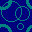

# FunGEn pong tutorial

This is a reconstructed copy of the tutorial, included here for
completeness. You may prefer to read the better-styled
[original](http://www.cin.ufpe.br/\~haskell/fungen/example.html).

Here we'll develop, step by step, a small version of a very famous game
called Pong. The player will use the left and right arrow keys to move a
bar horizontally, and he will need to hit a ball that moves around the
screen. When the ball is hit, a sound is played and 10 points is added to
the score, which will be displayed in the bottom left corner of the
screen. All of this is done using less than 80 lines of code, showing how
powerful is the combination of Haskell and game engines. (The following
code is explained in almost all details, but since you read it once,
you'll get very familiar with FunGEn. Nevertheless, it is possible to
understand everything reading only the blue shaded code. It is very
intuitive.)

Ok, here we go. The first thing to do is to declare the main module and to
import module FunGEn:

    module Main where

    import FunGEn

Now it is necessary to define an algebraic data type for the game special
attributes (in this case, the score, which is represented by an Int type):

    data GameAttribute = Score Int

Before we start to implement the main function, let's define two type
synonyms that will help our code to be more legible. The first refers to
the objects of the game. In FunGEn, every object has the type `GameObject s`,
where s is the type of the object special attribute (usually an
algebraic data type such as `GameAttribute`. Since we won't need any
special attribute for objects, let's leave the type s blank, or (). This
lead us to the following code:

    type PongObject = GameObject ()

The second type synonym refers to the type of the actions of our game. In
FunGEn, a game has the type `IOGame t s u v a`, where

- t is the type of the game special attributes;
- s is the type of the object special attributes;
- u is the type of the game levels;
- v is the type of the map tile special attribute, in case we use a `Tile Map` as the background of our game;
- a is the type returned by each action of the game (such as the Int for "IO Int")

The name IOGame was chosen to remind that each action deals with a Game,
but an IO operation can also be performed between game actions (such as
the reading of a file or printing something in the prompt).

Let's think about each one of these types. The type t was already defined
before: it is the algebraic data GameAttribute, which contains information
about the score. We can leave s as () because, as mentioned before, we
won't use special attributes for objects. Our game will not have different
levels, so we can also set u as (). Finally, because we won't use a Tile
Map as our game background, we can also set v as (). So the action of our
game (call it PongAction) will be a type synonym just like that

    type PongAction a = IOGame GameAttribute () () () a

Notice that the a type is not pre-defined. The same way that a function
returns an IO Int, IO Char, etc., our game functions will be able to
return an PongAction Int, PongAction Char and so on. In other words, the a
type refers to the value produced by each of our game actions. (If you are
used to Monads, you may have already noticed that IOGame is a state
tranformer monad: it transforms the state Game producing a value of type
a.

Ok, that was the most boring part. Now we can start to do some nice
coding. Let's define our Main function. In FunGEn, you must think of it as
having the following structure:

    main :: IO ()
    main = do
            <some local definitions>
            <a call to funInit using the definitions above>

The first local definition, generally, tells how our game window will look
like. We need to specify its initial position (x,y) in pixels, its
(width,height) in pixels and its title. The following code says that our
window will have its initial position at the top left corner of the screen
(0,0), its (width,height) will be (250,250) and its title will be "A brief
example!":

    main :: IO ()
    main = do
            let winConfig = ((0,0),(250,250),"A brief example!")

Now let's use other local definition to specify the kind of map
(background) we are going to use. Let's use a Texture Map. This kind of
map fills the whole window with copies of a specified texture pattern,
loaded from a bitmap (.bmp) file. We need then to tell from which bmp file
are we going to use the texture, the horizontal and vertical size of the
texture and, finally, the size of the map. Suppose the file tex.bmp
contains the following texture and that we'll use it in our map:

Suppose also that each copy of this texture will have a size of 50, both
horizontally and vertically. This means that its width will occupy (50/250
= 20%) of the window, and the same to its height. If the value 250 were
used instead of 50, there would be only one copy of the texture, filling
the whole window, because it would occupy (250/250 = 100%) of the window
both horizontally and vertically.

So that's the trick to find how big will be the texture in a texture map:
its width will occupy (100\*TexWidth/WindowWidth)% of the screen width,
and its height will ocuppy (100\*TexHeight/WindowHeight)% of the window
height. In our case (50 for both width and heigth of the texture), the
window will have exactly 25 copies of the texture, since we have 50x50
sized squares filling a 250x250 sized window.

Finally, we define the size of the map, which generally is the same of the
window (in our game, (250,250)). All of this blah-blah-blah to code is
(remember we are still "inside" the let):

	    bmpList = [("tex.bmp",Nothing)]
	    gameMap = textureMap 0 50 50 250.0 250.0

Please notice that we used a local definition called bmpList to specify a
list of all bitmap filepaths we'll use in our game (in this case, only
"tex.bmp"). The Nothing value indicates that we don't want any invisible
colors when drawing the bitmap. It is very common, however, to use the
magenta color as an invisible color. If we used it, all magenta pixels of
our bitmap would not be drawn. We'll talk more about colors later.

The position of the "tex.bmp" filepath in the list (the first position is
0) is the first parameter of function textureMap. Yes, it is a function,
not a type constructor. FunGEn will use this function to do some internal
computations, an then produce the appropriate constructor for the
map. Keep in mind the signature of textureMap:

    textureMap <index of texture> <relative width of texture> <relative heigth of texture>
               <map width in pixels> <map height in pixels>

Now let's define our game objects. A game object is an important entity of
the game. In our game, we can think of the ball and the bar as the game
objects.

In FunGEn, objects must be grouped. For example, in the pac-man game, one
group of objects would be composed by the ghosts, another group by the
pac-man food and, finally, a last group containing only the pac-man
itself. As you may have noticed, groups of objects contains similar or
closely related objects. In Pong, the ball and the bar have no close
relation, so we'll have two distinct groups: one containing the bar and
the other, the ball. To create a group, we need to call function
objectGroup, which receives the name of the group and a list of object as
parameters. Into code:

            bar    = objectGroup "barGroup"  [createBar]
            ball   = objectGroup "ballGroup" [createBall]

Notice that createBar and createBall are functions that will create the
bar and the ball respectively, and we'll need to define them later.

The next local definition initializes the game special attribute (in our
game, the score). So let's define the inial score as 0, using:

            initScore = Score 0

Now we'll write the last local definition of our game. This one will be
responsible for identifying which keyboard keys will have a meaning in our
game. We do this defining a list of triples, where each triple contains a
key, an event related to that key and an action (a function to be
performed when the event happens). There are three possible events related
to a keyboard key:

1. It was pressed;
2. It was released;
3. It is being pressed.

Events 1 and 3 are different. Event 1 happens once when the key is
pressed, and won't happen again until the key is released and then pressed
again. Event 3, othwewise, happens a lot of times between the press and
the release of a key. In FunGEn, each of these events are implemented as a
type constructor, as respectively shown below:

1. Pressed
2. Released
3. StillDown

In our game, what we'll need is the following:

- While the left arrow key is being pressed (StillDown), call a function
  that moves the bar to left (say moveBarToLeft)
- While the right arrow key is being pressed (StillDown), call a function
  that moves the bar to right (say moveBarToRight).

Nothing would be more intuitive:

            input = [(KeySpecial KeyRight, StillDown, moveBarToRight),
                     (KeySpecial KeyLeft,  StillDown, moveBarToLeft)]

Now we have a lot of local definitions, each one doing a different thing:

- Configuration of the game window (winConfig);
- Definition of a list containing all the filepaths of the bitmaps used in the game (bmpList);
- Definition of the game map (gameMap);
- Definition of the object groups of the game (bar and ball);
- Initialization of the game special attribute, or score (initScore);
- Specification of the keys that will be interpreted in our game and their respective event actions (input).

What should we do with them? Call function funInit! Here you have it (the 3 other parameters will be explained below): 

        funInit winConfig gameMap [bar,ball] () initScore input gameCycle (Timer 40) bmpList

Notice that:

- The object groups must be passed as a list ([bar,ball]);
- The fourth parameters refers to the initial game level. Since in this case there are no levels, it is left as ();
- The seventh parameter is a function that will be executed at each game cycle. It is the heart of the game and the place where we'll check if the bar hits the ball, for example. We called this function gameCycle, and it must be implemented by us (as shown later);
- The eighth parameter tells the game execution rate, in miliseconds. In this case, at each 40 miliseconds we'll have an execution (or cycle) of the game. During the game cycle, the map and objects are drawn, the objects are moved (according to their position and speed, as will be shown later), and our function gameCycle is called. Besides (Timer x), another possible value for this parameter is Idle: the game execution will happen as faster as possible, according to the CPU availability.

Important (1): Using Idle can make your game to run at different rates in different computers.

Important (2): Using a very slow value for x in (Timer x) can cause an unexpected behavior in the game execution rate, since there may be not enough time between the game cycles for the CPU to process data.

Now we are done with Main, and the only thing left to do is to implement
some functions called in it. The first two of them is the creation of the
ball and the bar.

The function createBall must return a game object. We have already defined
the type of this object in the beginning of our code: PongObject. So this
will be the type of createBall. Now how do we really create and object in
FunGEn? A very simple and useful structure for doing this is the following
one:

    createObject :: <ObjectType>
    createObject = let objPic = <define the picture of the object>
                   in <call object function using objPic and other desired params>

The picture refers to how an object will be drawn (or rendered). In FunGEn, the picture of an object can be:

- A texture;
- A basic primitive (polygon or circle)

Both the bar and the ball will have basic primitives for their
pictures. Let's consider the ball a green circle, with a radius of 3.0
screen units, i.e., its width and heigth will occupy (100*3/250)% of the
screen's width and height respectively. Let's also define its initial
position in the screen as (125,125) screen units, and its speed as (-5,5)
screen units per cycle. The (0,0) position is always located in the bottom
left corner, so the ball will start the game in the middle of the screen,
moving to the top left corner (FunGEn is responsible for moving all game
objects, according to their speed and position). After the first game
cycle, the new ball position will be (120,130), for example.

All of this object creation is done by the following code: 

    createBall :: PongObject
    createBall = let ballPic = Basic (Circle 3.0 0.0 1.0 0.0 Filled)
                 in object "ball" ballPic False (125,125) (-5,5) ()

Let's take a look at the above code. The first value after the constructor
Circle defines the radius of the ball. The next three numbers refers to
the color of the ball, in the RGB (Red Green Blue) format. Each of the
three colors can vary from 0.0 to 1.0, so (1.0 1.0 1.0) represents white
(the total presence of all colors) while (0.0 0.0 0.0) represents black
(the total absence of all three colors). Hence, the value (0.0 1.0 0.0)
says that our ball is green. Finally, the value Filled says that the
interior os the ball is also green. If we used Unfilled instead, only the
border of the ball (its most outside circumference) would be drawn.

The function object is then called to effectively create the object. Its
parameters are the name of the object, its picture, its sleeping status,
its initial position, its inicial speed and its special attribute (which,
as we defined before, does not make any sense in our game). If the
sleeping status of the ball were True, FunGEn would ignore it when moving,
drawing and checking collisions between it and other objects. One can
always change the attributes of and object by get and set functions, as it
will be shown later.

Important: FunGEn automatically creates the size attribute for an object.

The creation of the bar is very similar. Suppose we'd like an unfilled
white rectangle to represent the picture of the bar, and that its initial
position is (125,30) screen units and its initial speed is null (0,0). The
code would be:

    createBar :: PongObject
    createBar = let barBound = [(-25,-6),(25,-6),(25,6),(-25,6)]
                barPic = Basic (Polyg barBound 1.0 1.0 1.0 Unfilled)
                in object "bar" barPic False (125,30) (0,0) ()

The only new thing in the above code is the local definition barBound,
which is a list of points related to the centre of the bar. They must be
listed in counter-clockwise order. They're also expressed in screen units.

Now let's define the function moveBarToRight, which will be called when
the player holds the right keyboard key. Basically, what we'll need to do
is to find (retrieve) the bar object from the game and increment its
position (let's increment it by 5 units). The following code does this
task:

    moveBarToRight :: PongAction ()
    moveBarToRight = do
        obj <- findObject "bar" "barGroup"
        (pX,pY) <- getObjectPosition obj
        (sX,_)  <- getObjectSize obj
        if (pX + (sX/2) + 5 <= 250)
                then (setObjectPosition ((pX + 5),pY) obj)
                else (setObjectPosition ((250 - (sX/2)),pY) obj)

The functions findObject, getObjectPosition, getObjectSize,
setObjectPosition and setObjectPosition are all FunGEn
functionalities. The first of them find an object, given its name and the
name of its group. Notice that there is a check to avoid the bar from
moving beyond the right window boundary. This check needs to know the
position and size of the ball, which are retrieved via getObjectPosition
and getObjectSize respectively. After the check is done, the new position
of the bar is set properly, via setObjectPosition, which receives the new
position (x,y) and the object to be modified as parameters. Notice that
the type of this function (and of all functions that changes the state of
our game) is PongAction (), as defined before.

Important: You'll may have problems if you create two objects with the
same name in the same group, or two groups with the same name. But no
problems will occur if two objects, from two different groups, have the
same name.

To the moveBarToLeft function, the routine is almost the same. The
difference is that now we need to avoid the bar from moving to beyond the
left window boundary. The final check is then modified; the code for this
function is:

    moveBarToLeft :: PongAction ()
    moveBarToLeft = do
        obj <- findObject "bar" "barGroup"
        (pX,pY) <- getObjectPosition obj
        (sX,_)  <- getObjectSize obj
        if (pX - (sX/2) - 5 >= 0)
                then (setObjectPosition ((pX - 5),pY) obj)
                else (setObjectPosition (sX/2,pY) obj)

Don't give up now, we're almost done. The last thing remaining to do is the
implementation of the gameCycle function. It will be executed every cycle,
so it is the right place to describe the game behavior. Its first task is
to retrieve the score (the game special attribute) and print it on the
screen. Hence, the beginning of this fuction would be:

    gameCycle :: PongAction ()
    gameCycle = do
        (Score n) <- getGameAttribute
        printOnScreen (show n) BitmapTimesRoman24 (0,0) 1.0 1.0 1.0

Both getGameAttribute and printOnScreen functions are FunGEn pre-defined
functions. The first retrieves the game special attribute, and the later
prints a string in the screen, given the string, the font type, the
position of the bottom left corner of the text and the color in RBG.

Now let's find the ball object and check if it have collided with any
border of the map. If the collision was against the left or right border,
the horizontal speed must be changed. Case the top border was hit, the
vertical position must be the one changed. If, otherwise, the collision
was against the bottom border, the player loses the game and we finish it
(calling funExit) This is done by the following piece of code (remember
we're still inside gameCycle:

        ball <- findObject "ball" "ballGroup"
        col1 <- objectLeftMapCollision ball
        col2 <- objectRightMapCollision ball
        when (col1 || col2) (reverseXSpeed ball)
        col3 <- objectTopMapCollision ball
        when col3 (reverseYSpeed ball)
        col4 <- objectBottomMapCollision ball
        when col4 (funExit)

It is worth observing that the exiting function funExit, the collision
detection functions and the speed reversing functions are also provided by
FunGEn, and that a when corresponds to an if without an else (for monadic
actions, such as IO or IOGame).

Now we check if the bar have hit the ball. We first find the bar object,
call the objectsCollision function and do the check. If it happened, we
call FunGEn sound function to play a sound, then reverse the speed of the
ball and, finally, add 10 points to the score. Into code:

        bar <- findObject "bar" "barGroup"
        col5 <- objectsCollision ball bar
        when col5
                (do sound "hit.wav" [Async]
                    reverseYSpeed ball
                    setGameAttribute (Score (n + 10)))

Notice that the sound function receives the sound filepath and a list of
configurations. Here, Async says that the game execution must not wait for
the sound to be completely executed to continue; the sound plays and the
game execution continues at the same time.

Ok, now we ARE DONE. When executed, our game would look like:

Please notice that, in our example, when the ball hits one of the sides of
the bar, its horizontal speed won't change, so it will "enter" the
bar. Try it! Can you change the above code to avoid this...?

One last thing: would you like to check the frame per seconds rate of the
game? Try adding the following code line to the end of gameCycle and see
what happens:

        showFPS BitmapTimesRoman24 (30,0) 1.0 0.0 0.0

And that's it. We created a game with many different functionalities and a
nice performance in less than 80 lines of code. Hope you enjoyed!
